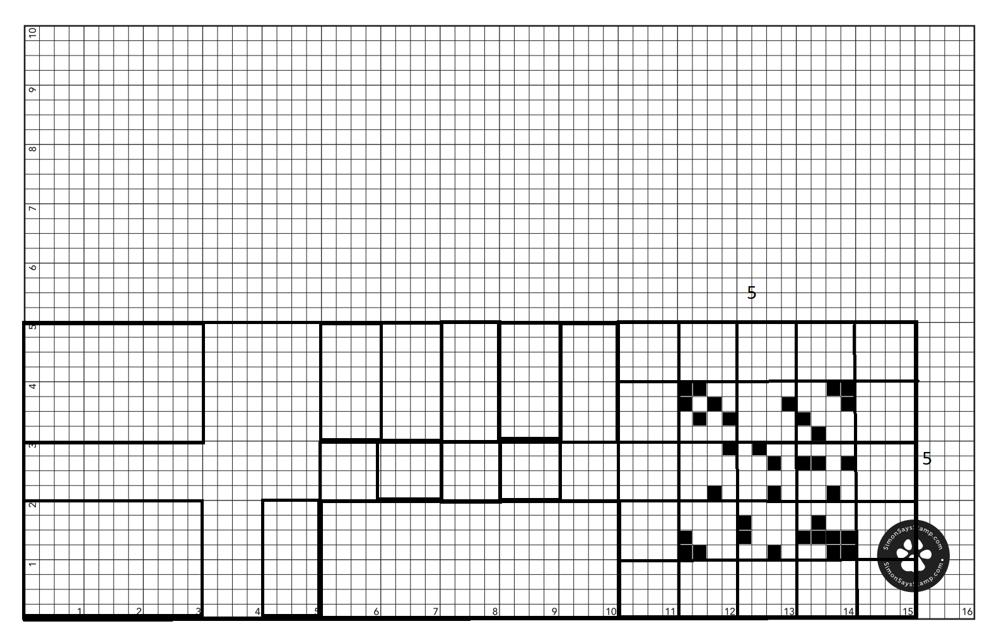
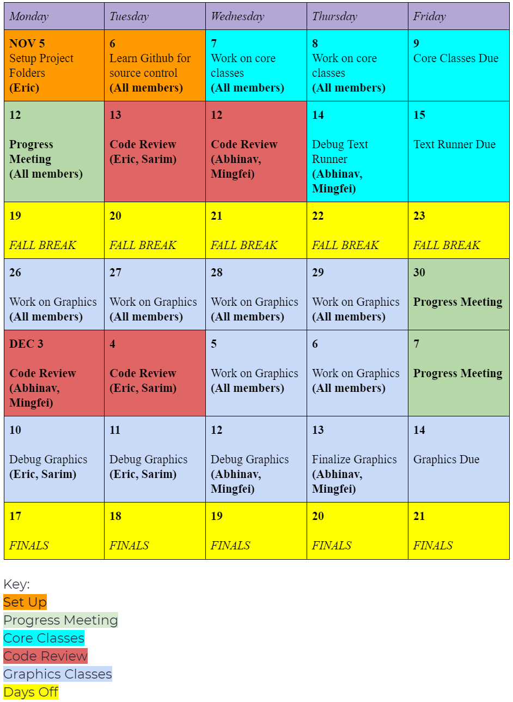

[](https://discordapp.com/)

# Camel Up

Our Java program attempts to digitally emulate the popular board game Camel Up. In this repository, we will detail our process of care coordination to build this complex program. The instructions to the board game will be listed in the repository or the link following.
[Game Instructions](https://www.fgbradleys.com/rules/rules2/CamelUp-rules.pdf)

# Graphics Board



# Organization

## Schedule



## Task Manager

[Click Up](https://app.clickup.com/)

# Tools

We are using

```
Java
Eclipse IDE
IntelliJ IDEA
```
